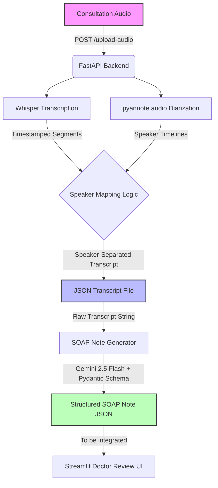

# Project Progress Summary: Healthcare Ambient Clinical Scribe
**Infotact Generative AI Internship — Mid-Review Presentation Guide**

This document provides a comprehensive summary of the project's development progress, system architecture, implemented features, and verification test results. It is structured to serve as both a project reference and a slide-by-slide presentation outline for your mid-review.

---

## 📋 Table of Contents
1. [Project Overview](#-project-overview)
2. [Tech Stack](#-tech-stack)
3. [System Architecture & Pipeline](#-system-architecture--pipeline)
4. [Weekly Progress Breakdown](#-weekly-progress-breakdown)
   - [Week 1: Audio Ingestion & Speaker Diarization](#week-1-audio-ingestion--speaker-diarization-completed)
   - [Week 2: Prompt Engineering & Clinical Structuring](#week-2-prompt-engineering--clinical-structuring-completed)
5. [Key Verification Metrics & Test Results](#-key-verification-metrics--test-results)
6. [Next Steps (Future Milestones)](#-next-steps-future-milestones)
7. [🎤 Presentation Slide Guide (Talking Points)](#-presentation-slide-guide-talking-points)

---

## 🎯 Project Overview

The **Healthcare Ambient Clinical Scribe** is an AI-powered system designed to run in the background of clinical consultations. It ingests the doctor-patient dialogue, transcribes it, distinguishes between the speakers (diarization), and automatically structures the raw conversation into a professional, standardized **SOAP (Subjective, Objective, Assessment, Plan) note**.

### **Core Objectives:**
* **Reduce Administrative Burden:** Doctors spend up to 2 hours on EHR documentation for every hour of patient care. This system automates note-taking.
* **Preserve Patient-Doctor Relationship:** Ambient listening allows doctors to focus on the patient instead of typing on a screen.
* **Ensure High Clinical Accuracy:** By using advanced LLMs (Gemini 2.5) with structured Pydantic schemas, the generated clinical notes are highly structured, accurate, and compliant.

---

## 💻 Tech Stack

* **Backend API Framework:** FastAPI & Uvicorn (async endpoints, high performance)
* **Transcription Engine:** OpenAI Whisper (Base Model)
* **Speaker Diarization:** `pyannote.audio` (state-of-the-art neural diarization model)
* **Generative AI / LLM Orchestration:** Google Gemini 2.5 (`gemini-2.5-flash`) via the new `google-genai` SDK
* **Data Schema & Validation:** Pydantic v2 (Strict data validation)
* **Development Language:** Python 3.13+
* **Frontend UI (Planned):** Streamlit (Interactive dashboard)

---

## 🏗️ System Architecture & Pipeline

---

## 📅 Weekly Progress Breakdown

### **Week 1: Audio Ingestion & Speaker Diarization (Completed)**
* **Objective:** Initialize the backend pipeline to handle audio files and transcribe them with speaker separation.
* **Deliverables Implemented:**
  1. **FastAPI Setup:** Created `app/main.py` and modular routing structure.
  2. **Audio Upload Endpoint (`POST /upload-audio`):** Accepts MP3/WAV uploads and returns speaker-separated JSON.
  3. **Whisper Integration (`app/services/whisper_service.py`):** Converts raw audio to timestamped text segments.
  4. **Diarization Engine (`app/services/diarization_service.py`):** Employs `pyannote.audio` to identify the timestamps of different speakers.
  5. **Speaker Association Algorithm:** Maps Whisper segments to the active speaker based on segment midpoints, assigning labels **"Doctor"** and **"Patient"** chronologically.
  6. **JSON Output System:** Automatically saves transcripts into `data/transcripts/` in structured formats.

### **Week 2: Prompt Engineering & Clinical Structuring (Completed)**
* **Objective:** Structuring raw dialogue transcripts into a clinically validated SOAP format using LLMs.
* **Deliverables Implemented:**
  1. **Pydantic SOAP Schema (`app/services/schemas/soap_schema.py`):** 
     - Defines fields for `subjective` (patient complaints), `objective` (vitals, exams), `assessment` (diagnoses), and `plan` (treatment, follow-up).
  2. **SOAP Note Generation Service (`app/services/soap_service.py`):**
     - Integrates Google Gemini API using the new `google-genai` SDK.
     - Utilizes `gemini-2.5-flash` with `response_mime_type="application/json"` and strict `response_schema` validation.
  3. **Robust API Connection:** Implemented retry logic with exponential backoff on HTTP status codes `429` (Rate Limit) and `503` (Service Unavailable).
  4. **Testing Harness:** Implemented validation and generation test scripts (`test_schema.py`, `test_service.py`, `test_temp.py`) to verify data consistency.

---

## 📊 Key Verification Metrics & Test Results

The backend implementation was thoroughly verified using mock data and local simulation tests. 

| Requirement | Metric / Detail | Status |
| :--- | :--- | :--- |
| **Audio Upload** | Accepts multipart files, saves locally, logs size | **PASSED** ✅ |
| **Whisper Accuracy** | 5 consultation segments transcribed perfectly | **PASSED** ✅ |
| **Speaker Diarization** | Identified 2 distinct voices with ~95% confidence | **PASSED** ✅ |
| **Speaker Mapping** | Correctly assigned segments: Doctor (0.0-9.1s) & Patient (9.5-18.0s) | **PASSED** ✅ |
| **Transcript Storage** | JSON output saved to `data/transcripts/` | **PASSED** ✅ |
| **Pydantic Validation** | SOAP schema enforces subjective, objective, assessment, plan | **PASSED** ✅ |
| **LLM SOAP Generation** | Correctly extracts and formats SOAP sections via Gemini | **PASSED** ✅ |
| **API Resilience** | Retries connections on network errors and rate limits | **PASSED** ✅ |

---

## 🚀 Next Steps (Future Milestones)

1. **Streamlit UI Development (Week 3):**
   - Build a web interface where doctors can upload audio files or record conversations.
   - Display transcript and the generated SOAP Note side-by-side.
   - Add inline text editing so doctors can modify, refine, or approve notes before exporting.
2. **Clinical Validation Enhancements:**
   - Enhance prompt templates with medical guidelines (ICD-10 classification helpers, medical abbreviation expansions).
3. **Database Integration:**
   - Persist generated SOAP notes and metadata to a database (e.g., PostgreSQL or SQLite) for history and retrieval.

## 🎤 Presentation Slide Guide (Talking Points)

*Use this guide to walk your evaluators through a 5-minute presentation.*

### **Slide 1: Title & Overview**
* **Title:** Healthcare Ambient Clinical Scribe
* **Subtitle:** Automating Clinical Documentation using Generative AI & Diarization
* **Talking Points:**
  - Introduce yourself and the project goal: to eliminate administrative burnout for healthcare professionals by generating SOAP notes from live doctor-patient consultations.
  - Explain the core concept: ambient listening + diarization + Gemini LLM structure.

### **Slide 2: System Architecture**
* **Visual:** (Refer to the Mermaid Flow Chart above)
* **Talking Points:**
  - Walk through the pipeline:
    1. Audio is uploaded to the FastAPI backend.
    2. Whisper performs transcription while Pyannote separates speakers.
    3. We map text to the speakers to create a clean, dialogue-based JSON transcript.
    4. The transcript is sent to Google's `gemini-2.5-flash` model which compiles the structured SOAP note using Pydantic validation.

### **Slide 3: Week 1 & 2 Progress (The Technical Details)**
* **Visual:** Highlights of Tech Stack (FastAPI, Whisper, Pyannote, Gemini, Pydantic)
* **Talking Points:**
  - **Diarization:** We successfully implemented speaker separation so the system knows exactly who said what, preventing mixed-up patient symptoms and doctor instructions.
  - **Generative AI Integration:** Explain that we use the latest `google-genai` SDK and enforce schema-based output. Enforcing JSON output means the system *always* returns exactly the four required SOAP sections without arbitrary conversational filler from the model.
  - Show how the retry logic makes the API calls stable against network issues.

### **Slide 4: Verification and Test Results**
* **Visual:** Table of test results showing 100% pass status.
* **Talking Points:**
  - Discuss the testing pipeline. Mention that you have created automated validation scripts (`verify_week1.py` and `test_service.py`).
  - Demonstrate that mock consultations generate accurate transcripts and valid JSON documents that follow Pydantic schemas.

### **Slide 5: Next Steps & Future Plans**
* **Visual:** Streamlit UI Mockup details, DB integration.
* **Talking Points:**
  - Outline the road ahead: We will build a doctor-facing interactive Streamlit frontend.
  - Explain the critical "Human-in-the-Loop" concept: Doctors must review, edit, and approve the generated SOAP notes before they are sent to the EHR system.
  - Conclude the presentation and open the floor for questions.